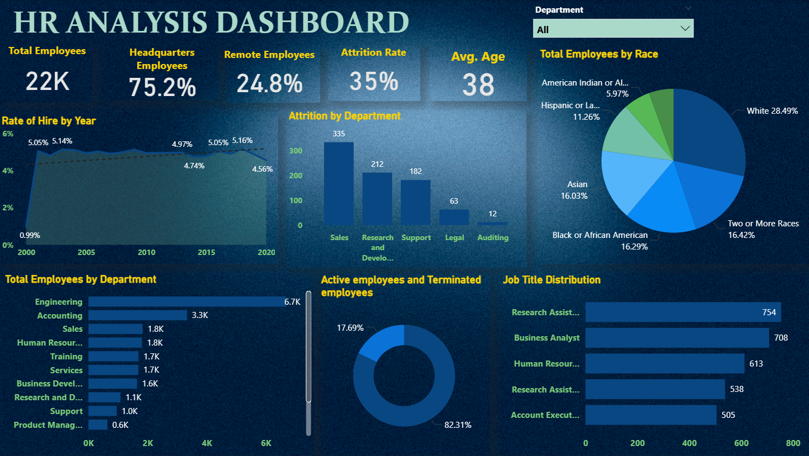

# HR-Analytics-Dashboard

📊 Overview : - 

This dashboard helps HR analysts and business leaders:

- Understand workforce composition across departments and demographics
- Monitor yearly hiring patterns
- Identify attrition hotspots
- Track employee status (active vs terminated)
- Analyze job roles and race distribution
- Support workforce planning & retention strategies

📊 Dashboard Features : -

🔢 Executive KPIs

- Total Employees — 22K
- Headquarters Employees — 75.2%
- Remote Employees — 24.8%
- Attrition Rate — 35%
- Average Age — 38 Years

📈 Visual Insights

📅 Rate of Hire by Year = Shows hiring trend patterns from 2000 to 2020.

Helps HR understand:

- Hiring growth or decline
- Years with strongest recruitment
- Long-term recruitment stability

🧑‍💼 Attrition by Department = Helps identify High-risk departments & Areas needing retention strategies

A bar chart showing departments with highest attrition numbers:

- Sales — 335
- R&D — 212
- Support — 182
- Legal — 63
- Auditing — 12

🌎 Total Employees by Race = Supports diversity & inclusion metrics.

Pie chart showing workforce diversity:

- White — 28.49%
- Two or More Races — 16.42%
- Black or African American — 16.29%
- Asian — 16.03%
- Hispanic / Latino — 11.26%
- American Indian / Alaska Native — 5.97%

🏢 Total Employees by Department = Helps understand workforce distribution.

Horizontal bar chart comparing department sizes:

- Engineering — 6.7K
- Accounting — 3.3K
- Sales — 1.8K
- HR — 1.8K
- Training — 1.7K
- Services — 1.7K
And others...

🔵 Active vs Terminated Employees = Useful for Retention analysis &  Workforce continuity tracking

A donut chart showing employee status:
- Active Employees — 82.31%
- Terminated Employees — 17.69%

💼 Job Title Distribution = Shows role-wise population and hiring focus.

Highlights the top job positions:

- Research Assistant — 754
- Business Analyst — 708
- HR — 613
- Research Associate — 538
- Account Executive — 505

🎛️ Filters & Slicers : -

Interactive filters include:

- Department (Makes entire dashboard dynamic)
  - Enables detailed department-level insights.

🛠️ Tools & Technologies : -

- Power BI (Data Visualization)
- Data Preparation: Excel / Power Query
- Modeling: Relationships, DAX Measures
- Dataset: HR employee demographics, job roles, department data, attrition history

📂 Dataset Features Used : -

- Employee demographics (age, race, employment type)
- Department & job title
- Hiring year
- Attrition flag
- Employee status (active/terminated)
- Workforce distribution by race & job role

💼 Business Impact : -

- Offers complete visibility into workforce structure
- Helps identify departments with high attrition
- Improves recruitment planning through hiring trend analysis
- Supports diversity and inclusion initiatives
- Enhances decision-making with accurate, structured HR insights

🧠 Key Insights Delivered : -

- Engineering has the largest workforce at 6.7K employees
- Sales shows the highest attrition (335 employees lost)
- Workforce diversity is well distributed across races
- Hiring trends stabilized after early growth years
- Majority workforce (82%) remains active, indicating strong retention
- Job roles such as Research Assistant and Business Analyst dominate employee count
